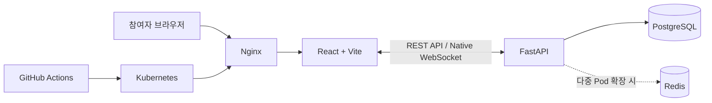

  

  <h1>MODU-PICK</h1>

  
<strong>모두가 납득하는 유쾌한 선택</strong>

  

    팀장·역할·팀명을 정할 때 생기는 눈치 싸움과 감정 소모를 
    실시간 미니게임으로 바꾸는 게임형 의사결정 플랫폼입니다.
  

  

    
    
    
    
    
    
    
  

  

    <a href="https://app.notion.com/p/7-28-e6fde0c692b883b18f3d019ed917e9b8?source=copy_link">Project Notion</a>
    ·
    <a href="https://www.figma.com/design/IIqIz0uigrSQJnyTDKDsg6/%EB%AA%B0%EC%9E%85-%EB%94%94%EC%9E%90%EC%9D%B8?node-id=0-1">Figma Design</a>
    ·
    <a href="https://github.com/SunMoonUniv">GitHub Organization</a>
  

---

## MODU-PICK은 어떤 서비스인가요?

조별 과제, 스터디, 해커톤, 사내 TF처럼 처음 만난 팀에서는 팀장·역할·팀명처럼 사소하지만 꼭 필요한 결정을 내리는 데 생각보다 많은 시간이 듭니다.

MODU-PICK은 이 과정을 **설치와 로그인 없이 바로 참여할 수 있는 실시간 미니게임**으로 바꿉니다. 방을 만들고 초대 코드를 공유하면 팀원들이 동시에 접속해 채팅하고, 준비 상태를 맞춘 뒤, 모두가 같은 결과를 보는 게임으로 결정을 끝낼 수 있습니다.

> **핵심 가치:** 빠른 아이스브레이킹 · 공정한 결과 · 무지연 실시간 동기화

## 핵심 기능

- **로그인 없는 빠른 시작** — 방 생성 또는 6자리 초대 코드 입력만으로 참여합니다.
- **개성 있는 프로필** — 닉네임, 캐릭터, GitHub 아이디 등의 소개 태그를 설정합니다.
- **실시간 대기방** — 입장·퇴장, Ready 상태, 채팅, 타이핑 상태를 모든 참여자에게 동기화합니다.
- **방장 중심의 게임 설정** — 방장이 게임과 옵션을 고르고, 팀원은 변경 내용을 실시간으로 확인합니다.
- **6종 의사결정 게임** — 무작위 추첨, 역할 배분, 익명 투표, 순발력 게임을 상황에 맞게 선택합니다.
- **서버가 확정하는 공정한 결과** — 무작위 결과와 시간 판정을 서버 기준으로 처리해 모든 화면에 같은 결과를 보여줍니다.
- **게임 이후에도 이어지는 흐름** — 결과 확인 후 다시 하기 또는 대기방 복귀를 선택할 수 있습니다.

## 주요 화면

<table>
  <tr>
    <td width="50%">
      
    </td>
    <td width="50%">
      
    </td>
  </tr>
  <tr>
    <td align="center"><strong>실시간 대기방</strong> 참여자, 채팅, Ready 상태, 게임 설정을 한 화면에서 관리합니다.</td>
    <td align="center"><strong>운명의 룰렛</strong> 모든 참여자의 화면에서 동일한 룰렛과 결과를 보여줍니다.</td>
  </tr>
</table>

  

  <strong>킹메이커</strong> 
  아이디어를 익명으로 제출하고 투표해 팀명·프로젝트명·메뉴 등을 결정합니다.

## 6개의 미니게임

| Game | 이름 | 결정하는 방법 | 활용 예시 |
| :---: | --- | --- | --- |
| 01 | **운명의 룰렛** | 참여자 중 한 명을 공정하게 무작위 추첨 | 팀장, 발표자, 벌칙 정하기 |
| 02 | **랜덤 사다리** | 참여자와 여러 역할을 한 번에 연결 | PPT, 자료 조사, 발표 역할 분담 |
| 03 | **킹메이커** | 익명 의견 제출 후 투표로 최종 선택 | 팀명, 프로젝트명, 메뉴 정하기 |
| 04 | **시간초 잡기** | 목표 시간에 가장 가깝게 타이머 정지 | 순서, 당첨자, 벌칙 대상 정하기 |
| 05 | **익명 저격** | 질문에 맞는 참여자를 제한 시간 안에 익명 지목 | 숨은 능력자 찾기, 아이스브레이킹 |
| 06 | **눈치게임** | 순서가 겹치지 않게 버튼을 누르고 마지막까지 생존 | 순발력 기반 역할·순서 정하기 |

## 사용자 흐름

1. 방장이 방을 만들고 초대 코드를 공유합니다.
2. 팀원은 코드를 입력하고 닉네임과 캐릭터를 설정합니다.
3. 모두 대기방에 들어와 채팅하고 `준비 완료`를 누릅니다.
4. 방장이 게임과 옵션을 설정한 뒤 게임을 시작합니다.
5. 모든 참여자가 동기화된 게임 화면에서 함께 플레이합니다.
6. 결과를 확인한 뒤 다시 하거나 대기방으로 돌아갑니다.

## 목표 아키텍처

MVP에서는 Ready·온라인 여부·현재 소켓처럼 수명이 짧은 상태를 서버 메모리에서 관리하고, 방·참여자·게임 회차·투표·최종 결과처럼 복구가 필요한 데이터만 PostgreSQL에 저장합니다. 여러 서버 인스턴스로 확장할 때 Redis 도입을 고려합니다.

## 기술 스택

| 영역 | 기술 | 선택 이유 |
| --- | --- | --- |
| Frontend | React, Vite | 실시간 SPA를 빠르게 개발하고 사용자 상태 변화에 즉시 반응 |
| Backend | Python, FastAPI | 비동기 API와 WebSocket 로직을 한 흐름으로 구현 |
| Realtime | Native WebSocket | 의존성을 줄이고 이벤트 프로토콜을 명확하게 관리 |
| Database | PostgreSQL, SQLAlchemy, Alembic | 관계·제약조건 중심의 데이터 설계와 안전한 마이그레이션 |
| Local Infra | Docker, Docker Compose | 팀원이 같은 환경을 빠르게 구성 |
| Deployment | Kubernetes, Nginx | 컨테이너 운영, 트래픽 분산, 확장 기반 마련 |
| CI/CD | GitHub Actions | 테스트·빌드·배포 작업 자동화 |

## 개발 원칙

- 모든 게임 결과와 시간 판정은 **서버를 단일 기준**으로 삼습니다.
- 같은 입력이 재전송되어도 한 번만 반영되도록 멱등성을 보장합니다.
- 익명 게임에서는 투표자 정보를 일반 응답과 화면에 노출하지 않습니다.
- 실시간 애니메이션 프레임은 저장하지 않고, 복구에 필요한 회차와 최종 결과만 저장합니다.
- 방장이 이탈하거나 방이 만료되면 참여자에게 상태를 알리고 관련 데이터를 안전하게 정리합니다.

## 프로젝트 진행 현황

> 2026-07-28 기준

- [x] 프로젝트 기획 및 6종 미니게임 규칙 정의
- [x] 사용자 흐름, 와이어프레임, 화면 설계
- [x] 기술 스택 선정
- [ ] REST API · WebSocket 명세 최종 확정
- [ ] 데이터 모델링 및 마이그레이션
- [ ] 프론트엔드 · 백엔드 구현
- [ ] CI/CD 및 배포 환경 구성
- [ ] QA/QC · 통합 테스트

## 협업 영역

| 영역 | 주요 책임 |
| --- | --- |
| PM · QA · Test | 요구사항 관리, 일정 조율, 품질 기준 및 테스트 |
| Design | 사용자 흐름, 화면 설계, 디자인 시스템 및 인터랙션 |
| Frontend | 대기방·게임 UI, 실시간 상태 반영, 클라이언트 연출 |
| API · WebSocket | REST API, 실시간 이벤트 계약, 인증·권한 |
| Backend Logic | 방·참여자·게임 상태 머신과 서버 판정 |
| Database | 데이터 모델, 제약조건, 트랜잭션, 마이그레이션 |
| Docker · Kubernetes | 개발 환경, 배포, 라우팅, 운영 자동화 |

## 문서

- [프로젝트 허브 · Notion](https://app.notion.com/p/7-28-e6fde0c692b883b18f3d019ed917e9b8?source=copy_link)
- [UI/UX 디자인 · Figma](https://www.figma.com/design/IIqIz0uigrSQJnyTDKDsg6/%EB%AA%B0%EC%9E%85-%EB%94%94%EC%9E%90%EC%9D%B8?node-id=0-1)
- [프로젝트 조직 · GitHub](https://github.com/SunMoonUniv)

---

  <strong>어색한 침묵 대신, 모두가 웃으며 납득하는 선택.</strong> 
  MODU-PICK

